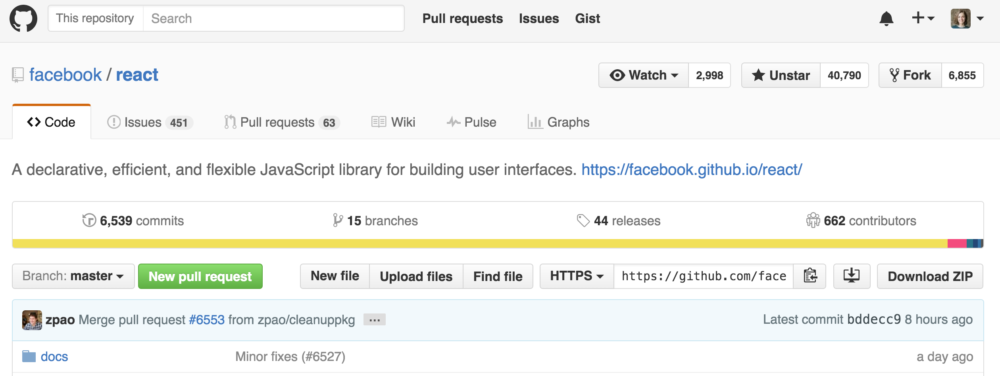

# How to Clone a Project from GitHub

To clone a project from the command line, you need the URL to the project's GitHub page (should be https).

For example: `https://github.com/username/reponame`

To clone the project, run following command in your terminal. Note the `.git` that's appended to the url.

```sh
$ git clone https://github.com/turingschool/lesson_plans.git
```

You can also get the URL from the project's main GitHub page (bottom left).

